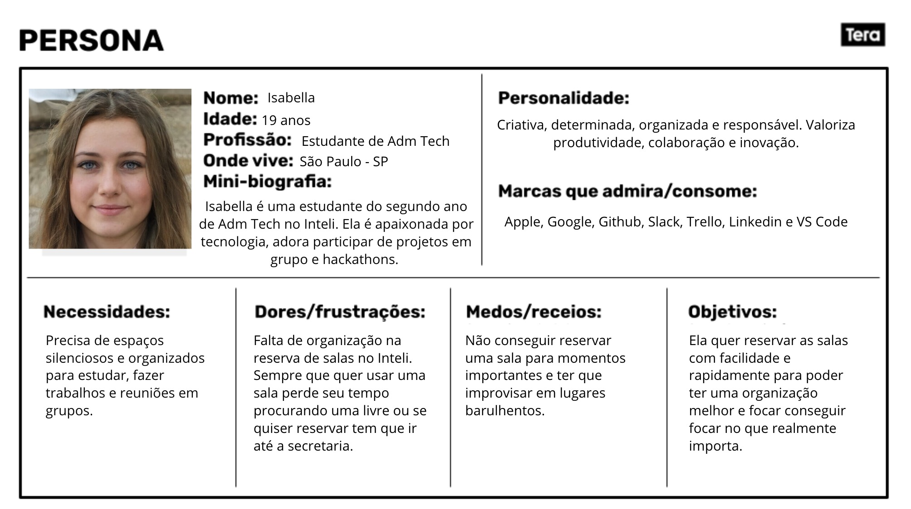

# Web Application Document - Projeto Individual - Módulo 2 - Inteli

**_Os trechos em itálico servem apenas como guia para o preenchimento da seção. Por esse motivo, não devem fazer parte da documentação final._**

## Nome do Projeto

#### Autor do projeto

## Sumário

1. [Introdução](#c1)  
2. [Visão Geral da Aplicação Web](#c2)  
3. [Projeto Técnico da Aplicação Web](#c3)  
4. [Desenvolvimento da Aplicação Web](#c4)  
5. [Referências](#c5)  

 

## 1. Introdução (Semana 01)

O sistema a ser desenvolvido nesse projeto individual terá a funcionalidade de agendar as salas para trabalho em grupo do Inteli por meio de uma aplicação web. Assim, seu objetivo é permitir que os usuários consigam visualizar as salas disponíveis, consultar os horários livres e reservar elas de forma mais simples e eficiente. Dessa forma, essa aplicação vai resolver problemas que os alunos do Inteli enfrentam diariamente ao buscar por salas disponíveis, pela falta de uma informação organizada e acessível sobre o agendamento dessas.  
Com isso, o sistema desenvolvido terá ferramentas que irão ajudar os alunos a se organizarem melhor. Nesse contexto, alguns mecanismos que farão parte desse aplicativo serão a habilidade de receber os pedidos de agendamento, verificar se a sala está disponível de acordo com sua disponibilidade de horários e permitir que o usuário cancele uma reserva. Tudo isso fará com que o aplicativo seja intuitivo e que funcione adequadamente para os alunos.

---

## 2. Visão Geral da Aplicação Web

### 2.1. Personas (Semana 01)

  Persona 
  

### 2.2. User Stories (Semana 01)

USO1 - Como aluno do Inteli, quero visualizar a lista de salas disponíveis, para que eu possa ver se tem alguma disponibilidade no horário que eu quero.

US02 - Como aluno do Inteli, quero reservar uma sala para um horário específico, para que eu possa garantir um espaço para os meus estudos.

US03 - Como aluno do Inteli, quero cancelar uma reserva feita, para que outra pessoa possa utilizar a sala caso eu não precise mais.

Explicação INVEST do US03: 
- Independent: A funcionalidade de cancelamento é independente da criação de uma nova reserva ou da visualização de salas, ou seja, pode ser desenvolvida e testada separadamente. 
- Negotiable: Os detalhes de como o cancelamento ocorre pode ser ajustado conforme a evolução do projeto
- Valuable: É muito importante para os alunos, pois libera a sala para outros alunos udarem.
- Estimable: É possível estimar o tempo e o esforço necessário para implementar essa funcionalidade.
- Small: O cancelamento de uma reserva é uma tarefa simples e pequena, que pode ser desenvolvida rapidamente.
- Testable: É fácil de testar e conferir se está dentro dos critérios estabelecidos.

---

## 3. Projeto da Aplicação Web

### 3.1. Modelagem do banco de dados  (Semana 3)

*Posicione aqui os diagramas de modelos relacionais do seu banco de dados, apresentando todos os esquemas de tabelas e suas relações. Utilize texto para complementar suas explicações, se necessário.*

*Posicione também o modelo físico com o Schema do BD (arquivo .sql)*

### 3.1.1 BD e Models (Semana 5)
*Descreva aqui os Models implementados no sistema web*

### 3.2. Arquitetura (Semana 5)

*Posicione aqui o diagrama de arquitetura da sua solução de aplicação web. Atualize sempre que necessário.*

**Instruções para criação do diagrama de arquitetura**  
- **Model**: A camada que lida com a lógica de negócios e interage com o banco de dados.
- **View**: A camada responsável pela interface de usuário.
- **Controller**: A camada que recebe as requisições, processa as ações e atualiza o modelo e a visualização.
  
*Adicione as setas e explicações sobre como os dados fluem entre o Model, Controller e View.*

### 3.3. Wireframes (Semana 03)

*Posicione aqui as imagens do wireframe construído para sua solução e, opcionalmente, o link para acesso (mantenha o link sempre público para visualização).*

### 3.4. Guia de estilos (Semana 05)

*Descreva aqui orientações gerais para o leitor sobre como utilizar os componentes do guia de estilos de sua solução.*

### 3.5. Protótipo de alta fidelidade (Semana 05)

*Posicione aqui algumas imagens demonstrativas de seu protótipo de alta fidelidade e o link para acesso ao protótipo completo (mantenha o link sempre público para visualização).*

### 3.6. WebAPI e endpoints (Semana 05)

*Utilize um link para outra página de documentação contendo a descrição completa de cada endpoint. Ou descreva aqui cada endpoint criado para seu sistema.*  

### 3.7 Interface e Navegação (Semana 07)

*Descreva e ilustre aqui o desenvolvimento do frontend do sistema web, explicando brevemente o que foi entregue em termos de código e sistema. Utilize prints de tela para ilustrar.*

---

## 4. Desenvolvimento da Aplicação Web (Semana 8)

### 4.1 Demonstração do Sistema Web (Semana 8)

*VIDEO: Insira o link do vídeo demonstrativo nesta seção*
*Descreva e ilustre aqui o desenvolvimento do sistema web completo, explicando brevemente o que foi entregue em termos de código e sistema. Utilize prints de tela para ilustrar.*

### 4.2 Conclusões e Trabalhos Futuros (Semana 8)

*Indique pontos fortes e pontos a melhorar de maneira geral.*
*Relacione também quaisquer outras ideias que você tenha para melhorias futuras.*

## 5. Referências

_Incluir as principais referências de seu projeto, para que seu parceiro possa consultar caso ele se interessar em aprofundar. Um exemplo de referência de livro e de site:_ 

---
---
