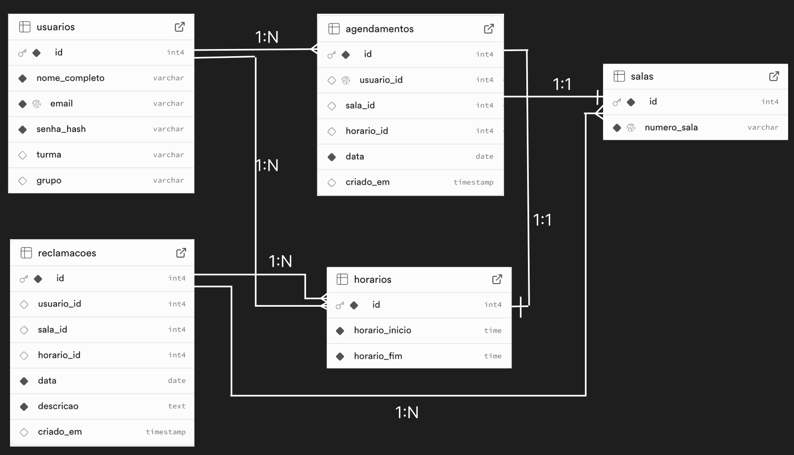
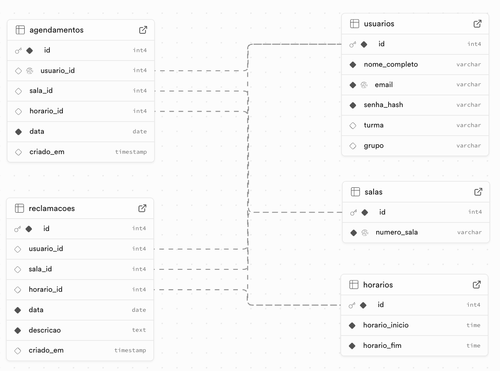
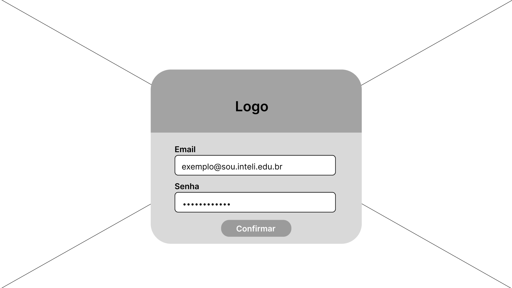
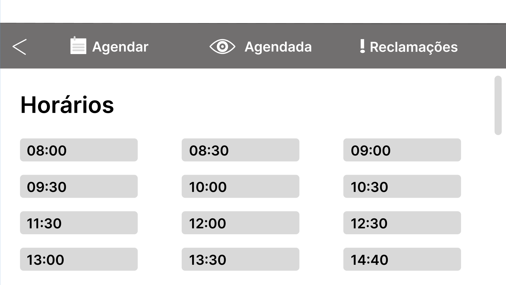
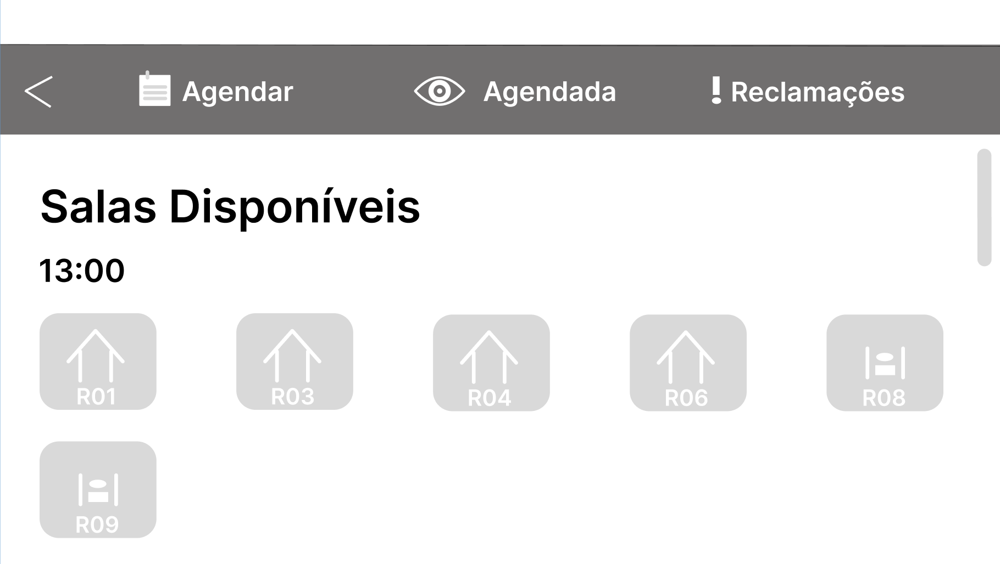
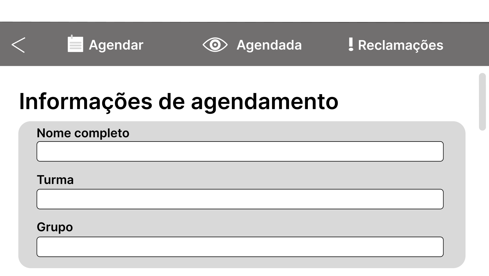
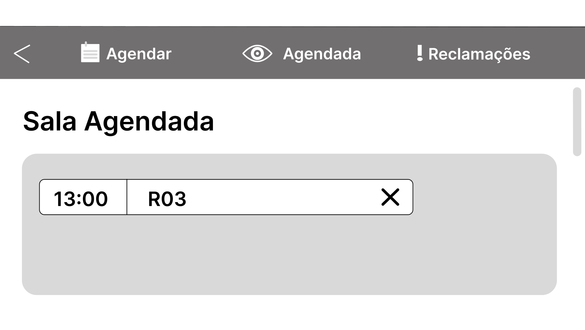
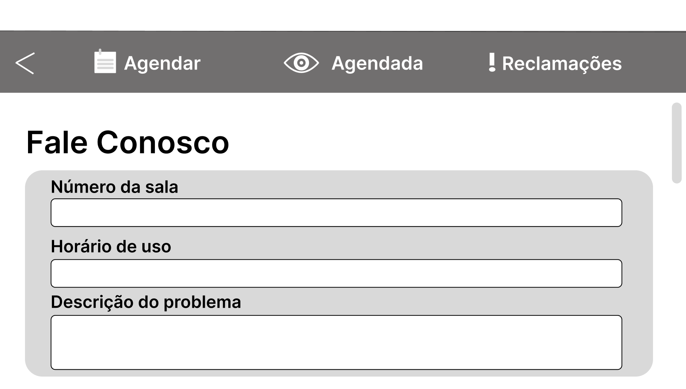

# Web Application Document - Projeto Individual - Módulo 2 - Inteli

**_Os trechos em itálico servem apenas como guia para o preenchimento da seção. Por esse motivo, não devem fazer parte da documentação final._**

## Nome do Projeto

#### Autor do projeto

## Sumário

1. [Introdução](#c1)  
2. [Visão Geral da Aplicação Web](#c2)  
3. [Projeto Técnico da Aplicação Web](#c3)  
4. [Desenvolvimento da Aplicação Web](#c4)  
5. [Referências](#c5)  

 

## 1. Introdução (Semana 01)

O sistema a ser desenvolvido nesse projeto individual terá a funcionalidade de agendar as salas para trabalho em grupo do Inteli por meio de uma aplicação web. Assim, seu objetivo é permitir que os usuários consigam visualizar as salas disponíveis, consultar os horários livres e reservar elas de forma mais simples e eficiente. Dessa forma, essa aplicação vai resolver problemas que os alunos do Inteli enfrentam diariamente ao buscar por salas disponíveis, pela falta de uma informação organizada e acessível sobre o agendamento dessas.  
Com isso, o sistema desenvolvido terá ferramentas que irão ajudar os alunos a se organizarem melhor. Nesse contexto, alguns mecanismos que farão parte desse aplicativo serão a habilidade de receber os pedidos de agendamento, verificar se a sala está disponível de acordo com sua disponibilidade de horários e permitir que o usuário cancele uma reserva. Tudo isso fará com que o aplicativo seja intuitivo e que funcione adequadamente para os alunos.

---

## 2. Visão Geral da Aplicação Web

### 2.1. Personas (Semana 01)

 Persona   

### 2.2. User Stories (Semana 01)

USO1 - Como aluno do Inteli, quero visualizar a lista de salas disponíveis, para que eu possa ver se tem alguma disponibilidade no horário que eu quero.

US02 - Como aluno do Inteli, quero reservar uma sala para um horário específico, para que eu possa garantir um espaço para os meus estudos.

US03 - Como aluno do Inteli, quero cancelar uma reserva feita, para que outra pessoa possa utilizar a sala caso eu não precise mais.

Explicação INVEST do US03: 
- Independent: A funcionalidade de cancelamento é independente da criação de uma nova reserva ou da visualização de salas, ou seja, pode ser desenvolvida e testada separadamente. 
- Negotiable: Os detalhes de como o cancelamento ocorre pode ser ajustado conforme a evolução do projeto
- Valuable: É muito importante para os alunos, pois libera a sala para outros alunos udarem.
- Estimable: É possível estimar o tempo e o esforço necessário para implementar essa funcionalidade.
- Small: O cancelamento de uma reserva é uma tarefa simples e pequena, que pode ser desenvolvida rapidamente.
- Testable: É fácil de testar e conferir se está dentro dos critérios estabelecidos.

---

## 3. Projeto da Aplicação Web

### 3.1. Modelagem do banco de dados  (Semana 3)

 Diagrama relacional do banco de dados completo:   

#### Entidades e Relacionamentos:

#### Usuários (`usuarios`)
Representam os usuários do sistema, ou seja, as pessoas que agendam as salas.

- Nome completo

- E-mail (único)

- Senha criptografada

- Turma

- Grupo

**Relacionamentos:**

- Um usuário pode fazer um único agendamento por vez

- Um usuário pode registrar várias reclamações

#### Salas (`salas`)
Representam as salas físicas disponíveis para reserva.

- Número/código da sala (ex: R07)

**Relacionamentos:**

- Uma sala pode estar presente em vários agendamentos

- Uma sala pode receber várias reclamações

#### Horários (horarios)
Blocos de tempo fixos de 30 minutos entre 08:00 e 20:00.

- Horário de início

- Horário de fim

**Relacionamentos:**

- Um horário pode estar presente em vários agendamentos

- Um horário pode ser referenciado em várias reclamações

#### Agendamentos (agendamentos)
Representam a reserva de uma sala feita por um usuário para um horário específico em uma data.

- Data da reserva

- Sala reservada

- Horário reservado

- Usuário responsável

- Data de criação do agendamento

**Relacionamentos:**

- Cada agendamento está vinculado a um usuário, uma sala e um horário

- Um usuário só pode ter um agendamento ativo por vez

#### Reclamações (reclamacoes)
Representam relatos de problemas com salas, como ar-condicionado, mesa, etc.

- Sala onde ocorreu o problema

- Horário em que a sala foi usada

- Data do uso

- Descrição do problema

- Usuário que reclamou

**Relacionamentos:**

- Cada reclamação está vinculada a um usuário, uma sala e um horário

 Diagrama de estrutura do banco de dados completo:    Fonte: Desenvolvido por Adriana 

#### Modelo Físico com o Schema do BD
📥 [Schema SQL completo](../scripts/init.sql)

### 3.1.1 BD e Models (Semana 5)
*Descreva aqui os Models implementados no sistema web*

### 3.2. Arquitetura (Semana 5)

*Posicione aqui o diagrama de arquitetura da sua solução de aplicação web. Atualize sempre que necessário.*

**Instruções para criação do diagrama de arquitetura**  
- **Model**: A camada que lida com a lógica de negócios e interage com o banco de dados.
- **View**: A camada responsável pela interface de usuário.
- **Controller**: A camada que recebe as requisições, processa as ações e atualiza o modelo e a visualização.
  
*Adicione as setas e explicações sobre como os dados fluem entre o Model, Controller e View.*

### 3.3. Wireframes (Semana 03)

- **Login:** esta será a primeira tela que o usuário vai ver ao entrar na aplicação, ao inserir seu email e senha e confirmar ele estará livre para navegar pelas próximas páginas. 

 Wireframe da tela de login:    

- **Agendar Horários:** na parte de Agendar o usuário vai se deparar com todos o horários possíveis para reservar uma sala ao longo do dia.

 Wireframe da primeira tela de agendamento:   
 

- **Agendar Sala:** após selecionar um horário o usuário será direcionada para uma tela onde aparecerá as salas disponíveis (que não estão reservadas) nesse horário específico.

 Wireframe da segunda tela de agendamento:   
 

- **Informações de Agendamento:** após selecionar uma sala, o usuário terá que informar o seu nome completo, turma e grupo para que todas as informções sejam armazenadas e organizadas. 

 Wireframe da terceira tela de agendamento:   
 

- **Agendada:** nessa parte o usuário poderá ver a sala e o horário que agendou, além de poder cancelar caso não precise mais.

 Wireframe da tela da sala agendada:   
 

- **Reclamações:** nessa aba o usuário poderá relatar qualquer problema que teve na sala, como por exemplo um erro no ar-condicionado, informando o número da sala, o horário de uso daquela sala e uma descrição do problema encontrado.

 Wireframe da primeira tela de reclamações:   
  

### 3.4. Guia de estilos (Semana 05)

O guia de estilos tem como objetivo padronizar o desenvolvimento de uma interface, garantindo uma experiência consistente, agradável e intuitiva para o usuário. Ele deve ser utilizado como referência no desenvolvimento e na manutenção da aplicação. Assim, esses foram os elementos utilizados no projeto:

 Mini Guia de Estilos:   
 

## Cores:
- Primária: #665390 (Roxo) — para elementos de destaque, como botões principais, barras de navegação e títulos ativos.

- Secundárias:
    - #000000 (Preto) — para textos principais.
    - #FFFFFF (Branco) — para fundos e textos sobre fundos escuros.
    - #D9D9D9 (Cinza Claro) — para divisores, botões secundários e fundos neutros.
    - #726F6F (Cinza Escuro) — para textos secundários, informações complementares e ícones menos relevantes.

## Tipografia: 
- H1: títulos principais (como o nome da tela).
- H2: subtítulos ou seções importantes.
- H3 a H6: textos auxiliares, subtítulos menores e descrições.
- P: textos corridos, instruções e descrições detalhadas.

## Ícones:
- Voltar (seta): retorna à tela anterior.
- Agendar (calendário): acessa a tela de seleção de horários.
- Agendada (olho): visualiza agendamentos já feitos.
- Suporte (ponto de exclamação): acessa a tela de contato para suporte.
- Salas de grupo (casa): indica salas destinadas a reuniões em grupo.
- Salas individuais (salinha pequena): indica salas para uso individual.
- Cancelar (X): cancela um agendamento feito.

## Componentes e Navegação: 
- Botões: estão na cor primária (roxa) para ações principais e cinza claro para ações secundárias.
- Inputs: estão em fundo branco com bordas cinza claro para clareza e foco no preenchimento.
- Confirmações e Alertas: á a caixa modal (como na tela de cancelamento) com botões claros para "Sim" e "Não".

Para mais informações sobre o Layout Geral do projeto e uma visualização melhor, entre neste link: https://www.figma.com/design/cnJg4qv0v5QnYuTUXReWOh/ux?node-id=2065-197&m=dev&t=fm6ftigwHI33YodZ-1

### 3.5. Protótipo de alta fidelidade (Semana 05)
Um protótipo de alta fidelidade é uma representação visual e funcional muito próxima do produto final. Ele simula de forma realista tanto o design visual quanto a interatividade entre telas. Assim, abaixo é possível visualizar os protótipos deste projeto:

 Protótipo da tela de login:   
 

 Protótipo da primeira tela de agendamento:   
 

 Protótipo da segunda tela de agendamento:   
 

 Protótipo da terceira tela de agendamento:   
 

 Protótipo da primeira tela de agendada:   
 

 Protótipo da segunda tela de agendada:   
 

 Protótipo da tela de suporte:   
 

Aqui está o link para acessar os protótipos pelo figma: https://www.figma.com/design/cnJg4qv0v5QnYuTUXReWOh/ux?node-id=2065-197&m=dev&t=fm6ftigwHI33YodZ-1

### 3.6. WebAPI e endpoints (Semana 05)

*Utilize um link para outra página de documentação contendo a descrição completa de cada endpoint. Ou descreva aqui cada endpoint criado para seu sistema.*  

### 3.7 Interface e Navegação (Semana 07)

*Descreva e ilustre aqui o desenvolvimento do frontend do sistema web, explicando brevemente o que foi entregue em termos de código e sistema. Utilize prints de tela para ilustrar.*

---

## 4. Desenvolvimento da Aplicação Web (Semana 8)

### 4.1 Demonstração do Sistema Web (Semana 8)

*VIDEO: Insira o link do vídeo demonstrativo nesta seção*
*Descreva e ilustre aqui o desenvolvimento do sistema web completo, explicando brevemente o que foi entregue em termos de código e sistema. Utilize prints de tela para ilustrar.*

### 4.2 Conclusões e Trabalhos Futuros (Semana 8)

*Indique pontos fortes e pontos a melhorar de maneira geral.*
*Relacione também quaisquer outras ideias que você tenha para melhorias futuras.*

## 5. Referências

_Incluir as principais referências de seu projeto, para que seu parceiro possa consultar caso ele se interessar em aprofundar. Um exemplo de referência de livro e de site:_ 

---
---
